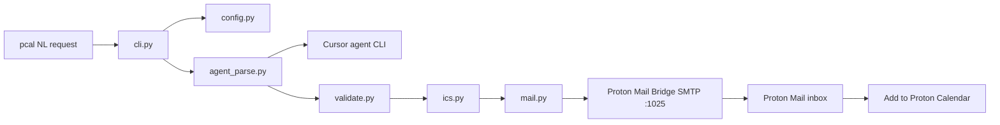

# Code map

Map of this project's codebase for the maintainer: which files do what, how data and control flow between them, where state lives.

## Layout

```
bin/pcal                 # run from repo without installing (`./bin/pcal`)
scripts/install.sh       # copies pcal/ → ~/.local/lib/pcal; writes ~/.local/bin/pcal
config.example.toml      # template copied by `pcal --init`
pcal/
  cli.py                 # argparse, orchestration, --dry-run / --init
  agent_parse.py         # calls `agent -p --mode ask --model composer-2.5`
  validate.py            # JSON → EventSpec (timed: end = start+1h; all-day: end = next day)
  ics.py                 # RFC 5545 METHOD:PUBLISH ICS (own calendar only)
  mail.py                # MIME calendar email + SMTP via Bridge
  config.py              # ~/.config/pcal/config.toml (+ PCAL_* env)
tests/                   # unit tests (mocked agent/SMTP)
```

## Install (global `pcal` command)

After `./scripts/install.sh`, two paths under `~/.local/` — different jobs, not two copies of the app:

| Path | Role |
|------|------|
| `~/.local/bin/pcal` | Small launcher on `PATH`; what you run when you type `pcal` |
| `~/.local/lib/pcal/` | Installed app: `pcal/` package + `config.example.toml` |

Re-run `./scripts/install.sh` after changing code in this repo. Use `./bin/pcal` to try repo changes without installing.

## Flow



## State

- Credentials / addresses: `~/.config/pcal/config.toml` (or `PCAL_CONFIG` / `PCAL_SMTP_PASSWORD`)
- No app database; each run is one-shot
- Local timezone default from the Mac (`datetime.now().astimezone()` / `/etc/localtime`) unless `timezone` is set in config
